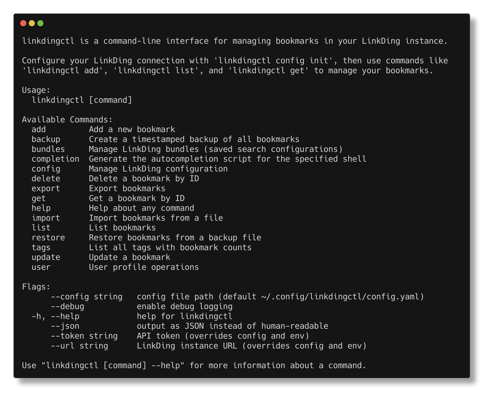

# LinkDing CLI (`linkdingctl`)

[](https://gitcgr.com/rodmhgl/linkdingctl)

A scriptable CLI for managing bookmarks in a [LinkDing](https://github.com/sissbruecker/linkding) instance.



## Features

- Full CRUD for bookmarks and tags
- Import/export in JSON, HTML (Netscape), and CSV formats
- Timestamped backup/restore
- `--json` output on all commands for scripting
- Single Go binary, no dependencies

## Installation

### Homebrew (macOS / Linux)

```bash
brew tap rodmhgl/tap
brew install linkdingctl
```

### From Binary Releases

Download the latest archive from the [Releases page](https://github.com/rodmhgl/linkdingctl/releases), extract, and place the binary on your `PATH`.

### From Source

```bash
git clone https://github.com/rodmhgl/linkdingctl
cd linkdingctl
go build -o linkdingctl ./cmd/linkdingctl
sudo mv linkdingctl /usr/local/bin/
```

## Quick Start

```bash
# Configure connection
linkdingctl config init

# Or use environment variables
export LINKDING_URL="https://linkding.example.com"
export LINKDING_TOKEN="your-api-token"

# Verify
linkdingctl config test

# Add a bookmark
linkdingctl add https://example.com --title "Example Site" --tags "reference,tools"

# List bookmarks
linkdingctl list
linkdingctl list --tags "homelab,docker"
linkdingctl list --unread --json
```

## Commands

### Configuration

```bash
linkdingctl config init          # Interactive setup
linkdingctl config show          # Show current config
linkdingctl config test          # Test connection
```

Config file: `~/.config/linkdingctl/config.yaml`

```yaml
url: https://linkding.example.com
token: your-api-token-here
```

Environment variables (`LINKDING_URL`, `LINKDING_TOKEN`) override the config file.

### Bookmarks

#### Add

```bash
linkdingctl add <url> [flags]
  -t, --title string         Bookmark title
  -d, --description string   Bookmark description
  -T, --tags strings         Comma-separated tags
      --unread               Mark as unread
      --shared               Make publicly shared
      --archived             Add to archive

linkdingctl add https://example.com --title "Example" --tags "dev,tools"
linkdingctl add https://news.com --unread --tags "reading-list"
```

#### List

```bash
linkdingctl list [flags]
  -q, --query string    Search query
  -T, --tags strings    Filter by tags
      --unread          Show only unread
      --shared          Show only shared
      --archived        Show only archived
      --limit int       Number of results (default: all)

linkdingctl list --tags "homelab"
linkdingctl list --query "kubernetes" --limit 10
```

#### Get / Update / Delete

```bash
linkdingctl get <id>
linkdingctl get 123 --json

linkdingctl update <id> [flags]
  --url string              New URL
  -t, --title string        New title
  -d, --description string  New description
  -T, --tags strings        Replace tags
      --add-tags strings    Add tags without removing existing
      --remove-tags strings Remove specific tags
      --unread bool         Set unread status
      --shared bool         Set shared status
      --archived bool       Set archived status

linkdingctl update 123 --title "New Title"
linkdingctl update 123 --add-tags "important"
linkdingctl update 123 --archived=true

linkdingctl delete <id>
linkdingctl delete 123 --force   # Skip confirmation
```

### Tags

```bash
linkdingctl tags                           # List all with counts
linkdingctl tags --sort name               # Sort by name or count
linkdingctl tags rename <old> <new>        # Rename across all bookmarks
linkdingctl tags delete <name>             # Delete (shows affected bookmarks)
linkdingctl tags delete "obsolete" --force # Skip confirmation
```

### Export / Import

```bash
linkdingctl export [flags]
  -f, --format string    json, html, csv (default: json)
  -o, --output string    Output file (default: stdout)
  -T, --tags strings     Export only matching tags
      --archived         Include archived (default: true)

linkdingctl export > bookmarks.json
linkdingctl export -f html -o bookmarks.html
linkdingctl export --tags homelab -f csv -o homelab.csv

linkdingctl import <file> [flags]
  -f, --format string      json, html, csv (default: auto-detect from extension)
  --dry-run                Preview without making changes
  --skip-duplicates        Skip existing URLs (default: update them)
  -T, --add-tags strings   Add tags to all imported bookmarks

linkdingctl import bookmarks.json
linkdingctl import bookmarks.html --add-tags "imported"
linkdingctl import export.csv --dry-run
```

### Backup / Restore

```bash
linkdingctl backup [flags]
  -o, --output string    Output directory (default: cwd)
      --prefix string    Filename prefix (default: "linkding-backup")

linkdingctl backup                    # Creates: linkding-backup-2026-01-22T103000.json
linkdingctl backup -o ~/backups/

linkdingctl restore <backup-file> [flags]
  --dry-run   Preview what would be restored
  --wipe      Delete ALL existing bookmarks first (requires confirmation)

linkdingctl restore backup.json --dry-run
linkdingctl restore backup.json --wipe
```

Without `--wipe`, restore updates existing bookmarks and adds new ones.

## Scripting Examples

```bash
linkdingctl list --json | jq '.count'
linkdingctl list --tags "homelab" --json | jq -r '.results[].url'
linkdingctl list --json | jq '.results[] | select(.tag_names | length == 0) | {id, title}'

# Nightly backup via cron
0 2 * * * linkdingctl backup -o ~/backups/ > /dev/null 2>&1
```

## Exit Codes

| Code | Meaning |
| ------ | --------- |
| 0 | Success |
| 1 | Error (API, network, etc.) |
| 2 | Configuration error |

## Version

```bash
linkdingctl version
linkdingctl version --json
```

## Shell Completions

Homebrew installs completions automatically. For manual setup:

```bash
# Bash
linkdingctl completion bash > /etc/bash_completion.d/linkdingctl

# Zsh
linkdingctl completion zsh > "${fpath[1]}/_linkdingctl"

# Fish
linkdingctl completion fish > ~/.config/fish/completions/linkdingctl.fish
```

## Claude Code Integration

`linkdingctl` ships [Claude Code skills](https://docs.anthropic.com/en/docs/claude-code/skills) that give Claude accurate CLI syntax and bookmark enrichment workflows. If you use Claude Code, install these skills so Claude can help you manage bookmarks without guessing flags or commands.

### Skills

| Skill | What it does |
| ----- | ------------ |
| `linkdingctl` | CLI reference — Claude knows exact flags, commands, and common mistakes |
| `bookmark-describer` | AI-driven enrichment of untagged bookmarks (adds titles, descriptions, and tags automatically) |

### Install from a cloned repo

```bash
cp -r .claude/skills/linkdingctl ~/.claude/skills/
cp -r .claude/skills/bookmark-describer ~/.claude/skills/
```

### Install directly from GitHub (no clone needed)

```bash
# linkdingctl skill
mkdir -p ~/.claude/skills/linkdingctl/references
curl -fsSL https://raw.githubusercontent.com/rodmhgl/linkdingctl/main/.claude/skills/linkdingctl/SKILL.md \
  -o ~/.claude/skills/linkdingctl/SKILL.md
curl -fsSL https://raw.githubusercontent.com/rodmhgl/linkdingctl/main/.claude/skills/linkdingctl/references/jq-recipes.md \
  -o ~/.claude/skills/linkdingctl/references/jq-recipes.md

# bookmark-describer skill
mkdir -p ~/.claude/skills/bookmark-describer
curl -fsSL https://raw.githubusercontent.com/rodmhgl/linkdingctl/main/.claude/skills/bookmark-describer/SKILL.md \
  -o ~/.claude/skills/bookmark-describer/SKILL.md
```

## Development

Requires Go 1.24+.

```bash
go build -o linkdingctl ./cmd/linkdingctl
go test ./...
```

### Project Structure

```text
cmd/linkdingctl/    # Command implementations
internal/
  api/              # LinkDing API client
  config/           # Configuration loading
  models/           # Data structures
  export/           # Import/export logic
```

## License

This project is licensed under the terms of the [MIT license](./LICENSE.md).

## Acknowledgments

Built for use with [LinkDing](https://github.com/sissbruecker/linkding) by sissbruecker.
